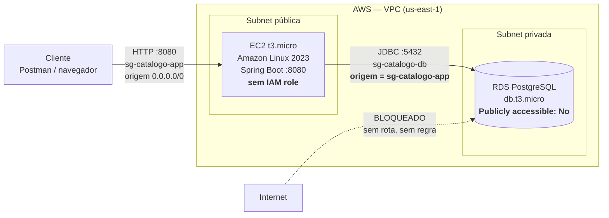

# Infraestrutura na AWS

Passo a passo para implantar a API na AWS pelo **AWS Academy Learner Lab**:
EC2 rodando a aplicação, RDS PostgreSQL como banco, Security Groups isolando as
camadas.

---

## 0. Antes de começar — as regras do Learner Lab

| Ponto | O que significa |
|---|---|
| **Sessão expira (~4h)** | Ao fim da sessão os recursos são parados/derrubados. **Não deixe a gravação para o fim de uma sessão longa.** |
| **Região fixa** | Normalmente `us-east-1`. Criar recurso em outra região costuma ser bloqueado. |
| **IAM restrito** | Não dá para criar roles/policies livremente. Existe uma role pronta chamada `LabRole` e um instance profile `LabInstanceProfile`. |
| **Tipos de instância limitados** | Famílias pequenas (`t2`/`t3`, até `medium` em geral). |
| **Key pair** | O lab oferece a chave `vockey`; o arquivo `labsuser.pem` é baixado pelo painel do lab. |
| **Orçamento** | Há um crédito limitado. Desligue o que não estiver usando. |

> Os detalhes acima variam entre turmas e versões do lab. Confirme no painel do
> seu Learner Lab antes de seguir — especialmente região, tipos liberados e o
> nome da key pair.

## 0.1 ⚠️ Siga este documento na ordem — de cima para baixo

**As seções deste documento são a ordem de execução.** Cada recurso depende do
anterior já existir; fora de ordem, ou você não consegue preencher um campo, ou
cria algo que vai precisar voltar para corrigir depois.

```text
Seção 1 → Security Group da aplicação  (sg-catalogo-app)
Seção 1 → Security Group do banco      (sg-catalogo-db)   ← referencia o de cima
Seção 2 → RDS PostgreSQL               (usa sg-catalogo-db)   ~10 min provisionando
Seção 3 → EC2                          (usa sg-catalogo-app)
Seção 4 → Deploy do jar na EC2
```

### O que quebra em cada ordem errada

| Se você fizer isso | O que acontece |
|---|---|
| Criar `sg-catalogo-db` **antes** de `sg-catalogo-app` | O campo *Source* não tem o que selecionar — o grupo da aplicação ainda não existe. Você fica sem a regra principal e precisa voltar |
| Criar o **RDS antes dos Security Groups** | Ele nasce com o SG `default`, que não libera a 5432 para a aplicação. A API sobe e falha na conexão, e o erro parece bug de código |
| Criar a **EC2 antes do RDS** | Você fica ~10 minutos com a instância ligada (consumindo crédito) esperando o banco. Pior: no passo 4.5 não há `DB_HOST` para preencher, porque o endpoint do RDS ainda não existe |
| Começar pela **seção 4 (Deploy)** | Não há instância para onde enviar o jar, nem endpoint de banco para configurar |
| EC2 e RDS em **AZs diferentes** | Funciona, mas paga tráfego entre zonas e adiciona latência a cada consulta |

> **A regra por trás disso:** na AWS você sempre cria **primeiro quem é
> referenciado, depois quem referencia**. Na hora de destruir (seção 7.4), a
> ordem é exatamente a inversa — primeiro quem usa, depois quem é usado. Um
> Security Group com recurso associado não pode ser apagado.

**Por que os Security Groups vêm antes de tudo:** o SG do banco precisa
**referenciar** o SG da aplicação como origem permitida. Essa referência só pode
ser feita se o grupo referenciado já existir — não é preferência de organização,
é dependência real.

**Por que o RDS vem antes da EC2:** ele demora ~10 minutos provisionando.
Criando-o primeiro, você usa esse tempo para montar a EC2, e quando chegar no
deploy o endpoint do banco já está disponível para o arquivo `.env`.

---

## 1. Security Groups — o coração da parte de segurança

Um **Security Group** é um firewall com estado, aplicado à *interface de rede* do
recurso. "Com estado" significa: se a entrada é permitida, a resposta sai
automaticamente — não é preciso liberar a volta.

### 1.1 `sg-catalogo-app` — a EC2

**VPC:** a default. **Regras de entrada:**

| Tipo | Protocolo | Porta | Origem | Por quê |
|---|---|---|---|---|
| Custom TCP | TCP | `8080` | `0.0.0.0/0` | A API **precisa** ser pública — é requisito do desafio |
| SSH | TCP | `22` | `SEU.IP.PUBLICO/32` | Administração. **Nunca** `0.0.0.0/0` |

**Regras de saída:** deixe a padrão (todo tráfego liberado). A aplicação precisa
alcançar o RDS e baixar pacotes.

> Descubra seu IP público em https://checkip.amazonaws.com — e lembre que ele
> **muda** quando você troca de rede ou o provedor renova. Se o SSH parar de
> funcionar do nada, é quase sempre isso.

### 1.2 `sg-catalogo-db` — o RDS

| Tipo | Protocolo | Porta | Origem | Por quê |
|---|---|---|---|---|
| PostgreSQL | TCP | `5432` | **`sg-catalogo-app`** | Só a aplicação fala com o banco |

**A origem é o outro Security Group, não um bloco de IP.** Isso é o detalhe que
diferencia uma configuração pensada de uma configuração copiada:

- **Não depende de IP.** Se a EC2 for recriada e mudar de IP, a regra continua
  valendo — a identidade é o grupo, não o endereço.
- **Escala sozinha.** Dez instâncias no mesmo SG, mesma regra.
- **É intenção declarada.** A regra diz "quem está no grupo da aplicação pode
  falar com o banco", que é exatamente a política de negócio.

Sem nenhuma regra permitindo `0.0.0.0/0` na 5432, **o banco não tem rota vinda da
internet** — mesmo que alguém descubra o endpoint e a senha.

---

## 2. RDS PostgreSQL

**Console → RDS → Create database**

| Campo | Valor | Observação |
|---|---|---|
| Método | Standard create | |
| Engine | PostgreSQL | |
| Template | **Free tier** | evita queimar crédito |
| DB instance identifier | `catalogo-db` | |
| Master username | `postgres` | |
| Master password | *senha forte* | anote — vai virar `DB_PASSWORD` |
| Instance class | `db.t3.micro` | |
| Storage | 20 GB gp3, **sem autoscaling** | |
| **Public access** | **No** | ⚠️ o item mais importante da tela |
| VPC security group | **`sg-catalogo-db`** (existente) | remova o `default` |
| Availability Zone | mesma da EC2 | evita tráfego entre AZs |
| **Initial database name** | `catalogo` | em *Additional configuration*. Se esquecer, o banco não é criado e a aplicação não conecta |
| Backup | retenção 0 dias | é um lab |
| Encryption | pode deixar ligado | |

Leva ~10 minutos até `Available`. Copie o **Endpoint** — algo como
`catalogo-db.abc123xyz.us-east-1.rds.amazonaws.com`.

### Por que "Public access: No"

Com `Yes`, o RDS ganha um IP público e passa a ser alcançável da internet — a
única barreira restante seria o Security Group. Com `No`, ele só existe dentro da
VPC: mesmo um SG mal configurado não abre o banco para fora. **Duas camadas, não
uma.** É a mesma ideia de defesa em profundidade da validação na aplicação.

---

## 3. EC2

**Console → EC2 → Launch instance**

| Campo | Valor |
|---|---|
| Name | `catalogo-api` |
| AMI | **Amazon Linux 2023** (64-bit x86) |
| Instance type | `t2.micro` ou `t3.micro` |
| Key pair | `vockey` (a do lab) |
| VPC/Subnet | default, **mesma AZ do RDS** |
| Auto-assign public IP | **Enable** |
| Security group | **existente → `sg-catalogo-app`** |
| Storage | 8 GB gp3 |
| IAM instance profile | **nenhum** (veja abaixo) |

### Permissões: por que esta aplicação não precisa de nenhuma

Um **IAM instance profile** dá à EC2 permissão de chamar a API da AWS (ler S3,
publicar em SQS, ler Secrets Manager…). Esta aplicação **não chama nenhum serviço
da AWS** — ela só abre uma conexão TCP com o Postgres, que é rede, não IAM.

Então a configuração mais segura é **não anexar role nenhuma**. Isso não é
preguiça, é o **princípio do menor privilégio** na forma mais pura: credencial
que não existe não vaza.

> Se em algum momento você quiser guardar a senha do banco no **AWS Secrets
> Manager** em vez de variável de ambiente, aí sim seria preciso anexar a
> `LabRole` (a única disponível no Learner Lab) para a instância conseguir ler o
> segredo. Fica como evolução, não como requisito.

---

## 4. Deploy da aplicação

> ⚠️ **Não comece por aqui.** Esta seção pressupõe que as seções 1, 2 e 3 já
> foram feitas: os dois Security Groups existem, o RDS está `Available` (com o
> endpoint copiado) e a EC2 está `running` (com o IP público anotado). Sem isso
> não há para onde enviar o jar nem o que preencher no `.env` do passo 4.5.
>
> Antes de seguir, tenha em mãos:
>
> | Informação | Onde pegar |
> |---|---|
> | IP público da EC2 | EC2 → Instances → *Public IPv4 address* |
> | Endpoint do RDS | RDS → Databases → `catalogo-db` → *Endpoint* |
> | Senha do master do banco | a que você definiu no passo 2 |
> | `labsuser.pem` | painel do Learner Lab |

### 4.1 Empacotar localmente

```bash
cd ~/github/cloud-senai
mvn clean package -DskipTests
ls -lh target/catalogo-1.0.0.jar
```

> O projeto compila para **Java 21** (`<java.version>21</java.version>`), que é a
> versão do Corretto padrão do Amazon Linux 2023. Se um dia o `pom.xml` subir para
> 25, será preciso instalar o Corretto 25 na instância — confira sempre antes de
> subir.

### 4.2 Preparar a chave SSH

```bash
chmod 400 ~/Downloads/labsuser.pem
```

Permissão diferente de `400`/`600` faz o SSH recusar a chave.

### 4.3 Enviar o jar

```bash
scp -i ~/Downloads/labsuser.pem \
    target/catalogo-1.0.0.jar \
    ec2-user@<IP-PUBLICO-DA-EC2>:/home/ec2-user/
```

### 4.4 Conectar e instalar o Java

```bash
ssh -i ~/Downloads/labsuser.pem ec2-user@<IP-PUBLICO-DA-EC2>

sudo dnf update -y
sudo dnf install -y java-21-amazon-corretto-headless
java -version          # deve mostrar 21
```

### 4.5 Variáveis de ambiente — o arquivo `.env`

#### O que este arquivo é, e por que ele existe

A aplicação precisa saber o endereço, o usuário e a senha do banco. Essas
informações **não podem estar no código**, porque o código vai para o GitHub.

A solução é o `application-prod.properties` não guardar os valores — só os
**buracos** onde eles entram:

```properties
spring.datasource.url=jdbc:postgresql://${DB_HOST}:${DB_PORT:5432}/${DB_NAME:catalogo}
spring.datasource.username=${DB_USER}
spring.datasource.password=${DB_PASSWORD}
```

Cada `${NOME}` é uma variável de ambiente que o Spring procura **na partida**. Se
achar, substitui. Se não achar, a aplicação nem sobe — falha com
`Could not resolve placeholder 'DB_HOST'`.

> A sintaxe `${DB_PORT:5432}` tem um **valor padrão** depois dos dois-pontos: se
> a variável não existir, ele usa `5432`. Repare que `DB_HOST`, `DB_USER` e
> `DB_PASSWORD` **não** têm padrão — de propósito. Não existe valor razoável para
> "endereço do banco", e um padrão silencioso aqui esconderia um erro de
> configuração.

#### O caminho que o valor percorre

```text
arquivo catalogo.env          "DB_HOST=catalogo-db.abc.rds.amazonaws.com"
        │
        │  systemd lê via EnvironmentFile= (ou o shell, via source)
        ▼
variável de ambiente do processo java
        │
        │  Spring lê no start e substitui o ${...}
        ▼
application-prod.properties   spring.datasource.url=jdbc:postgresql://catalogo-db.abc...
        │
        ▼
conexão JDBC com o RDS
```

**Nada disso passa pelo repositório.** O que existe no Git é o `.env.example` —
um modelo com os nomes das variáveis e valores falsos, para quem clonar saber o
que precisa preencher.

#### Criar o arquivo

```bash
cat > ~/catalogo.env <<'EOF'
DB_HOST=catalogo-db.abc123xyz.us-east-1.rds.amazonaws.com
DB_PORT=5432
DB_NAME=catalogo
DB_USER=postgres
DB_PASSWORD=SUA_SENHA_REAL
EOF

chmod 600 ~/catalogo.env
```

> ⚠️ **Use exatamente o nome `catalogo.env`.** O `.env.example` do repositório
> tem um comentário dizendo "copie para `.env`" — ignore esse nome, ou o serviço
> systemd do passo 4.7 (que aponta para `catalogo.env`) não vai encontrar o
> arquivo e falhará ao iniciar, com um erro que não menciona banco nenhum. Se
> preferir usar `.env`, mude **também** a linha `EnvironmentFile=` do 4.7.

#### De onde vem cada valor

| Variável | Onde pegar |
|---|---|
| `DB_HOST` | RDS → Databases → `catalogo-db` → **Endpoint** (sem a porta no fim) |
| `DB_PORT` | `5432`, o padrão do PostgreSQL |
| `DB_NAME` | O *Initial database name* que você definiu no passo 2 (`catalogo`) |
| `DB_USER` | O *Master username* do passo 2 (`postgres`) |
| `DB_PASSWORD` | A *Master password* que você definiu no passo 2 |

#### Por que assim, e não de outro jeito

**Nunca ponha a senha no comando:**

```bash
# NÃO faça isso
java -jar app.jar --spring.datasource.password=minhasenha123
```

Dois vazamentos de uma vez: a senha fica no `~/.bash_history` e aparece em
`ps aux` para **qualquer** usuário logado na máquina — linha de comando de
processo é informação pública no Linux.

**O `chmod 600`** deixa o arquivo legível e gravável só pelo dono. Sem isso, o
padrão costuma ser `644`, ou seja: qualquer usuário da instância lê a senha do
seu banco.

**O `<<'EOF'` com aspas simples** faz o shell tratar o conteúdo como texto puro.
Sem as aspas, uma senha contendo `$` teria o `$` interpretado como início de
variável e o valor gravado sairia errado — e você caçaria o erro no RDS.

#### Uma diferença entre o passo 4.6 e o 4.7

Os dois leem o mesmo arquivo, mas por caminhos diferentes:

| | Como lê | Consequência |
|---|---|---|
| 4.6 (teste manual) | `set -a; source ~/catalogo.env` — é o **bash** interpretando | Expande `$`, entende aspas e comentários como o shell faria |
| 4.7 (systemd) | `EnvironmentFile=` — o **systemd** parseando | **Não** expande `$`; trata aspas com regras próprias |

Na prática isso quase nunca aparece — mas se a senha do banco tiver `$`, `#` ou
espaço, é possível o teste manual funcionar e o serviço falhar (ou o contrário).
**Se acontecer, não procure bug na aplicação:** ou troque a senha do RDS por uma
alfanumérica, ou coloque o valor entre aspas duplas no arquivo.

#### Conferir se deu certo

```bash
# o arquivo existe com as 5 variáveis e a permissão certa?
ls -l ~/catalogo.env          # deve mostrar -rw-------
grep -c '^DB_' ~/catalogo.env # deve mostrar 5

# as variáveis realmente entram no ambiente?
set -a; source ~/catalogo.env; set +a
echo "$DB_HOST"               # deve imprimir o endpoint do RDS
```

### 4.6 Teste rápido antes de virar serviço

```bash
set -a; source ~/catalogo.env; set +a
java -jar catalogo-1.0.0.jar --spring.profiles.active=prod
```

Espere por `Started CatalogoApplication`. Em outro terminal:

```bash
curl http://localhost:8080/actuator/health
# {"status":"UP"}
```

Deu certo? `Ctrl+C` e siga para o serviço.

### 4.7 Rodar como serviço systemd

Sem isso, a aplicação morre quando você fecha o SSH — e não volta se a instância
reiniciar.

```bash
sudo tee /etc/systemd/system/catalogo.service > /dev/null <<'EOF'
[Unit]
Description=API de Catalogo de Produtos
After=network.target

[Service]
Type=simple
User=ec2-user
WorkingDirectory=/home/ec2-user
EnvironmentFile=/home/ec2-user/catalogo.env
ExecStart=/usr/bin/java -jar /home/ec2-user/catalogo-1.0.0.jar --spring.profiles.active=prod
SuccessExitStatus=143
Restart=on-failure
RestartSec=10

[Install]
WantedBy=multi-user.target
EOF

sudo systemctl daemon-reload
sudo systemctl enable --now catalogo
sudo systemctl status catalogo
```

Comandos úteis:

```bash
sudo systemctl restart catalogo     # após enviar um jar novo
sudo journalctl -u catalogo -f      # logs ao vivo
sudo journalctl -u catalogo -n 100  # últimas 100 linhas
```

`Restart=on-failure` é o que faz a aplicação voltar sozinha se cair —
disponibilidade de graça, e bom ponto para citar no vídeo.

### 4.8 Confirmar de fora

Da **sua máquina**, não da EC2:

```bash
curl http://<IP-PUBLICO-DA-EC2>:8080/actuator/health
```

Se responder `{"status":"UP"}`, a API está pública e funcionando.

---

## 5. Diagrama da arquitetura



**A leitura em uma frase:** a única porta aberta para a internet é a 8080 da
aplicação; o banco só aceita conexão de quem está no Security Group da aplicação
e não tem endereço público.

---

## 6. Tabela de justificativas de segurança

Esta tabela é a resposta pronta para "por que essa configuração?" — vale os 30%
de arquitetura da rubrica.

| Medida | Por que | O que ela impede |
|---|---|---|
| SSH (22) restrito ao IP da equipe | Menor privilégio na administração | Varredura automatizada e força bruta em SSH aberto |
| 8080 aberta em `0.0.0.0/0` | A API precisa ser pública — é requisito | (exposição consciente e mínima: só esta porta) |
| 5432 com origem = **SG da aplicação** | Identidade por grupo, não por IP | Qualquer origem que não seja a aplicação |
| RDS **sem** *Publicly accessible* | Segunda camada, independente do SG | Acesso direto ao banco mesmo com SG mal configurado |
| Credenciais em variáveis de ambiente | Segredo fora do código | Vazamento por repositório público / histórico do Git |
| `chmod 600` no arquivo `.env` | Menor privilégio no sistema de arquivos | Leitura por outro usuário da instância |
| **Nenhum IAM role na EC2** | A aplicação não chama serviço da AWS | Uso indevido de credencial temporária se a instância for comprometida |
| Console H2 desligado no perfil `prod` | Superfície de ataque desnecessária | Console de banco exposto na internet |
| Swagger UI: decisão consciente de manter ligado | Trabalho acadêmico — ajuda a avaliação. Em produção real, `springdoc.api-docs.enabled=false` no perfil `prod` | (exposição aceita: documentação da API é reconhecimento fácil para um atacante) |
| `server.error.include-stacktrace=never` | Não vazar detalhe interno | Reconhecimento de versão/estrutura por mensagem de erro |
| Mensagem genérica no handler de integridade | Idem, na camada de aplicação | Vazamento de nome de constraint/tabela |
| Grupos de segurança separados por camada | Isolamento por função | Movimento lateral entre camadas |

---

## 7. Custos: o que cobra, o que continua cobrando e como desligar tudo

### 7.1 A ideia que evita a surpresa

Na AWS você paga por **três coisas separadas**, e elas se comportam de formas
diferentes:

| O que | Cobra por | Parar a instância resolve? |
|---|---|---|
| **Computação** (a máquina ligada) | hora ligada | ✅ sim, para na hora |
| **Armazenamento** (o disco, os dados) | GB por mês, **24h por dia** | ❌ **não** — continua cobrando parado |
| **Rede** (dados saindo da AWS) | GB trafegado | ✅ sim, se ninguém acessa |

> **A armadilha:** "parar" (*stop*) desliga só a **computação**. O disco continua
> existindo e continua sendo cobrado — é como devolver o carro alugado mas
> continuar pagando a vaga na garagem. Parar é o certo **entre sessões de
> trabalho**. No fim do trabalho, o que zera a conta é **destruir**.

### 7.2 O que existe neste projeto e o que cada coisa cobra

| Recurso | Ligado | **Parado** | Destruído |
|---|---|---|---|
| **EC2** `t3.micro` | hora de instância | **nada** | nada |
| **Volume EBS** da EC2 (8 GB gp3) | GB/mês | **continua cobrando** | nada |
| **RDS** `db.t3.micro` | hora de instância | **nada** | nada |
| **Armazenamento do RDS** (20 GB) | GB/mês | **continua cobrando** | nada |
| **Backups automáticos do RDS** | GB/mês além do provisionado | **continua cobrando** | some junto com a instância, **se** você não guardar snapshot |
| **Snapshots manuais** (EC2 ou RDS) | GB/mês | **continua cobrando** | só somem se você apagar **um a um** |
| **Elastic IP**, se você alocou um | por hora, **inclusive sem uso** | **continua cobrando** | nada |
| **IP público automático da EC2** | por hora enquanto a instância roda | nada (ele é devolvido) | nada |
| **Security Groups, VPC, sub-redes** | **nada** | nada | nada |
| **Transferência de dados de saída** | GB que sai da AWS | nada | nada |

**Três consequências práticas:**

1. **Security Group não custa nada.** Não precisa apagar por economia — só por
   organização.
2. **Snapshot é o vazamento silencioso clássico.** Você destrói a instância,
   acha que acabou, e o snapshot fica lá consumindo crédito por meses. Se o
   diálogo de exclusão do RDS oferecer "criar snapshot final", **desmarque** —
   é um trabalho de faculdade, não tem dado para preservar.
3. **Elastic IP cobra parado.** É contraintuitivo: a AWS cobra justamente o IP
   *reservado e não usado*, para desestimular gente segurando endereço à toa. Se
   você alocar um, **libere** ao terminar.

### 7.3 Modo pausa — entre uma sessão e outra

Use quando for parar hoje e continuar amanhã, **mantendo os dados**.

**EC2:**

```text
Console → EC2 → Instances → selecionar catalogo-api
       → Instance state → Stop instance
```

**RDS:**

```text
Console → RDS → Databases → selecionar catalogo-db
       → Actions → Stop temporarily
```

⚠️ **Duas pegadinhas do RDS parado:**

- O RDS **religa sozinho depois de 7 dias**. É comportamento oficial da AWS, não
  bug. Se você parar e esquecer, na semana seguinte ele volta a cobrar hora de
  instância. Marque no calendário ou destrua de vez.
- Parado, ele **continua cobrando os 20 GB de armazenamento**.

**Ao religar,** o IP público da EC2 **muda** (o antigo foi devolvido). Atualize a
URL no Postman — veja [[Como Testar a API na AWS]].

Religar:

```text
EC2 → Instance state → Start instance
RDS → Actions → Start
```

A aplicação sobe sozinha, porque o systemd está com `enable`. Confirme:

```bash
ssh -i labsuser.pem ec2-user@<NOVO-IP>
sudo systemctl status catalogo
```

### 7.4 Modo desligar tudo — quando o trabalho acabou

**Faça só depois de entregar o vídeo.** Isto apaga os dados e é irreversível.

**Ordem importa:** destrua primeiro quem *usa*, depois quem *é usado*. Security
Group com recurso associado não pode ser apagado.

```text
1. EC2       → Instance state → Terminate instance
2. Volume    → EC2 → Volumes → conferir se sobrou algum "available" → Delete
3. RDS       → Actions → Delete
                 ├─ desmarcar "Create final snapshot"
                 ├─ desmarcar "Retain automated backups"
                 └─ digitar "delete me" para confirmar
4. Snapshots → RDS → Snapshots  e  EC2 → Snapshots → apagar o que houver
5. Elastic IP→ EC2 → Elastic IPs → Release (se você tiver alocado algum)
6. SGs       → EC2 → Security Groups → apagar sg-catalogo-app e sg-catalogo-db
                 (opcional: não custam nada)
```

**O passo 2 é o mais esquecido.** Ao terminar uma EC2, o volume raiz normalmente
é apagado junto (`Delete on termination` vem marcado por padrão) — mas se alguém
desmarcou isso, ou se houver volume extra, ele fica com status **`available`** e
**continua cobrando**. Vale os 10 segundos de conferir.

### 7.5 Conferência final — "não sobrou nada cobrando?"

Passe por estas cinco telas do console. Todas devem estar vazias (ou só com
recursos que não custam nada):

| Console | O que olhar | Estado desejado |
|---|---|---|
| EC2 → Instances | filtrar por "All states" | nenhuma `running` ou `stopped` |
| EC2 → Volumes | coluna State | nenhum `available` nem `in-use` |
| EC2 → Elastic IPs | lista | vazia |
| EC2 → Snapshots (Owned by me) | lista | vazia |
| RDS → Databases | lista | vazia |
| RDS → Snapshots (Manual **e** Automated) | as duas abas | vazias |

> **Como ver quanto já gastou:** no AWS Academy Learner Lab, o crédito restante
> aparece no topo do painel do lab (algo como `$XX used / $100`). O console de
> Billing e o Cost Explorer da AWS normalmente ficam **bloqueados** no Learner
> Lab, então o indicador do painel é a sua fonte de verdade. Confira antes e
> depois de uma sessão longa para saber quanto ela custou de verdade.

### 7.6 Sobre o Learner Lab especificamente

| Ponto | O que acontece |
|---|---|
| Sessão expira (~4h) | O lab **para** a EC2 e o RDS automaticamente |
| Mas **não destrói** | Os discos continuam existindo — e continuam consumindo crédito |
| Crédito é finito | Cada nova sessão consome mais; disco esquecido consome sozinho |
| Ao religar | IP público novo; refazer o deploy ou atualizar a URL |

> Ou seja: **contar com o encerramento automático da sessão não é suficiente.**
> Ele para a computação, que é a parte cara por hora, mas o armazenamento
> continua drenando crédito enquanto os recursos existirem. Terminado o trabalho,
> faça o passo a passo do 7.4.

> Os detalhes do lab variam entre turmas. Confirme no painel do seu Learner Lab —
> especialmente se ele **para** ou **destrói** os recursos ao fim da sessão.

### 7.7 Hábitos que evitam susto

- **Nunca provisione "para testar depois".** Recurso criado começa a cobrar na
  hora, mesmo sem uso.
- **`Free tier` no template do RDS** e instâncias `micro` — já está nas
  instruções acima.
- **Backup com retenção 0 dias** no RDS: sem backup automático, sem cobrança de
  backup.
- **Storage autoscaling desligado** no RDS: impede o disco crescer sozinho (e a
  conta junto).
- **Ao terminar a sessão do dia**, pare EC2 e RDS mesmo que vá voltar amanhã.
- **Ao terminar o trabalho**, destrua e passe pela conferência do 7.5.

---

## 8. Quando der errado

| Sintoma | Causa provável | Como confirmar |
|---|---|---|
| `curl` externo dá timeout | 8080 não liberada no `sg-catalogo-app` | Testar `curl localhost:8080` **dentro** da EC2: se funciona, é SG |
| `Connection refused` externo | Aplicação não está rodando | `sudo systemctl status catalogo` |
| App não sobe, erro de conexão JDBC | SG do RDS não referencia o SG da app, ou AZ diferente | Ver `journalctl -u catalogo -n 50` |
| `database "catalogo" does not exist` | Esqueceu o *Initial database name* no RDS | Criar o banco manualmente via `psql` |
| `password authentication failed` | `DB_PASSWORD` errado no `.env` | Conferir o arquivo; senha com caractere especial precisa de aspas |
| SSH `Permission denied` | Permissão do `.pem` | `chmod 400 labsuser.pem` |
| SSH `Connection timed out` | Seu IP público mudou | Atualizar a regra 22 no SG |
| `UnsupportedClassVersionError` | JVM da EC2 mais velha que o alvo do build | `java -version` na EC2 vs `<java.version>` do `pom.xml` |
| App sobe e cai sozinha | Memória da `t2.micro` | `journalctl -u catalogo`; considerar `-Xmx512m` no `ExecStart` |

---

## Documentos relacionados

- [[Como o Código Funciona]]
- [[Como Testar a API na AWS]]
- [[Roteiro do Vídeo e Justificativas]]
